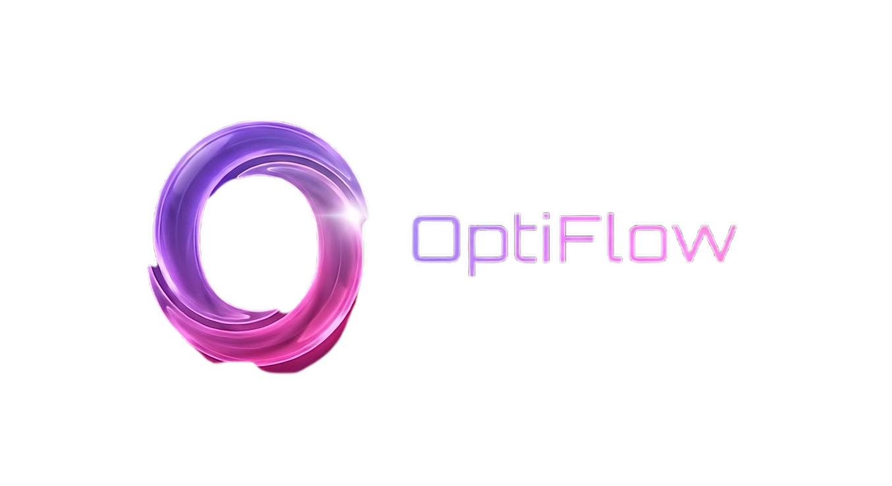

<p align="center">
  
</p>

# OptiFlow - Intelligent Production Scheduling System

**Smarter Scheduling. Smoother Production.**

OptiFlow is an intelligent production scheduling and workflow-management system developed for print shops and light-manufacturing environments. It helps managers organize jobs, define production tasks, allocate machines and workers, and automatically generate practical schedules. The system reduces manual scheduling effort, prevents resource conflicts, and helps production teams complete important jobs on time.

## Team

- E/22/320, M. S. Rashad, [e22320@eng.pdn.ac.lk](mailto:e22320@eng.pdn.ac.lk)
- E/22/337, K. Sadurshika, [e22337@eng.pdn.ac.lk](mailto:e22337@eng.pdn.ac.lk)
- E/22/385, S. Sulakshan, [e22385@eng.pdn.ac.lk](mailto:e22385@eng.pdn.ac.lk)
- E/22/409, S. Vikashan, [e22409@eng.pdn.ac.lk](mailto:e22409@eng.pdn.ac.lk)

## Supervisor

- E/21/148, S. Ganathipan, [e21148@eng.pdn.ac.lk](mailto:e21148@eng.pdn.ac.lk)

---

## Table of Contents

1. [Introduction](#1-introduction)
2. [Solution Architecture](#2-solution-architecture)
3. [Software Design](#3-software-design)
4. [Scheduling and Optimization](#4-scheduling-and-optimization)
5. [System Usage and Setup](#5-system-usage-and-setup)
6. [Testing](#6-testing)
7. [Limitations and Future Improvements](#7-limitations-and-future-improvements)
8. [Conclusion](#8-conclusion)
9. [Links](#9-links)

---

## 1. Introduction

### 1.1 Project Overview

Production environments often handle several jobs at the same time. Each job may contain multiple tasks, and every task may require a particular machine or worker. Tasks can also depend on one another. For example, a print job cannot be cut before printing is complete.

Creating these schedules manually becomes difficult when the number of jobs, tasks, deadlines, and resources increases. OptiFlow solves this problem by collecting production details through a simple user interface and using a mathematical optimization engine to create a conflict-free schedule.

### 1.2 Real-World Problem

Manual production scheduling may cause:

- Two tasks to be assigned to the same resource at the same time.
- Important jobs to be delayed.
- Task dependencies to be ignored.
- Machines or workers to remain idle unnecessarily.
- Deadlines to be missed.
- Managers to spend excessive time rearranging schedules.
- Workers to receive unclear or outdated task information.
- Machine recovery or break periods to be overlooked.

### 1.3 Proposed Solution

OptiFlow provides a centralized platform through which managers can create jobs, configure tasks, select suitable resources, and generate optimized schedules. The optimizer considers task duration, dependencies, job priority, resource capability, resource availability, existing work, and task-level machine breaks.

The generated schedule is saved in the database and displayed through manager and worker interfaces. This allows the production team to understand what must be done, when it must start, and which resource should perform it.

### 1.4 Objectives

The main objectives of OptiFlow are to:

- Reduce the time required to prepare production schedules.
- Prevent machines and workers from being double-booked.
- Respect task dependencies and production order.
- Give suitable consideration to job priorities and deadlines.
- Improve the use of available resources.
- Display schedules clearly to managers and workers.
- Support changes in job, task, and resource information.
- Provide a foundation for automatic rescheduling and production analytics.

### 1.5 Main Features

- Creation and management of production jobs.
- Multiple tasks within a single job.
- Multi-job schedule generation.
- High, medium, and low job priorities.
- Task durations entered using hours and minutes.
- Automatic conversion of duration values into minutes.
- Task dependency management.
- Optional restriction of a task to a particular resource.
- Automatic selection of a capable resource when no restriction is given.
- Task-level machine-break configuration.
- Conflict-free machine and worker allocation.
- Schedule timeline with processing and break details.
- Manager dashboard for monitoring jobs and schedules.
- Worker view for assigned tasks.
- Job and task status tracking.

---

## 2. Solution Architecture

OptiFlow follows a client-server architecture with four main parts:

1. A Flutter application for manager and worker interaction.
2. A FastAPI backend for validation and business logic.
3. A Google OR-Tools CP-SAT engine for schedule optimization.
4. A Supabase PostgreSQL database for persistent data storage.

```text
+---------------------------+
| Flutter Application       |
| Manager and Worker Views  |
+-------------+-------------+
              |
              | REST API / JSON
              v
+---------------------------+
| FastAPI Backend           |
| Validation and Logic      |
+-------------+-------------+
              |
       +------+------+
       |             |
       v             v
+--------------+  +---------------------------+
| Supabase     |  | Google OR-Tools CP-SAT    |
| PostgreSQL   |  | Scheduling Optimizer      |
+--------------+  +---------------------------+
```

### 2.1 Frontend

The frontend is developed using Flutter and Dart. It provides a cross-platform user interface for managers and workers.

The main frontend responsibilities are:

- Collecting job and task information.
- Validating required form fields.
- Converting entered hours and minutes into total processing minutes.
- Loading available resources from the backend.
- Allowing optional resource restrictions.
- Enabling or disabling a task-level machine break.
- Sending requests to the backend in JSON format.
- Displaying jobs, tasks, schedules, resources, and statuses.

### 2.2 Backend

The backend is developed using Python and FastAPI. It connects the user interface, database, and optimizer.

Its main responsibilities are:

- Exposing REST API endpoints.
- Validating request data using data models.
- Managing jobs, tasks, resources, and status updates.
- Reading scheduling data from the database.
- Sending scheduling constraints to the optimizer.
- Saving generated schedule results.
- Returning clear responses and error messages to the frontend.

### 2.3 Database

OptiFlow uses Supabase PostgreSQL. The database stores information such as:

- Users and roles.
- Production jobs.
- Job priorities and deadlines.
- Tasks and processing durations.
- Task dependencies.
- Machines and human resources.
- Resource capabilities.
- Optional resource restrictions.
- Machine-break settings.
- Scheduled start, processing end, and resource-release times.
- Job and task statuses.

### 2.4 Optimization Engine

Google OR-Tools CP-SAT is used to solve the scheduling problem. It assigns pending tasks to suitable resources and calculates valid start and end times while satisfying the system constraints.

The optimizer considers:

- Processing duration.
- Task dependencies.
- Dependency waiting time.
- Resource capabilities.
- Resource restrictions.
- Resource availability.
- Existing scheduled or in-progress work.
- Job priority.
- Job deadline.
- Task-level machine-break duration.
- Prevention of overlapping use of the same resource.

---

## 3. Software Design

### 3.1 Design Goals

The system was designed with the following goals:

- **Efficiency:** Generate useful schedules within a practical time.
- **Reliability:** Validate inputs and prevent invalid scheduling states.
- **Usability:** Present complex scheduling information in a simple form.
- **Maintainability:** Separate the frontend, backend, optimizer, and database responsibilities.
- **Scalability:** Support additional jobs, tasks, users, and resources.
- **Flexibility:** Allow either automatic resource selection or a specific restriction.
- **Consistency:** Store all schedule-related information in a central database.

### 3.2 Technology Stack

| Layer | Technology | Purpose |
|---|---|---|
| Frontend | Flutter and Dart | Cross-platform manager and worker interfaces |
| Backend | FastAPI and Python | REST APIs, validation, and business logic |
| Optimizer | Google OR-Tools CP-SAT | Constraint-based schedule generation |
| Database | Supabase PostgreSQL | Cloud-hosted relational data storage |
| Communication | REST and JSON | Frontend-backend data exchange |
| Testing | Pytest and Flutter Test | Backend and frontend verification |
| Version Control | Git and GitHub | Source-code management and collaboration |

### 3.3 Functional Modules

#### User Interface Module

Provides manager and worker screens and handles user input, navigation, validation, and result presentation.

#### Job Management Module

Allows managers to create and manage job orders containing a name, quantity, deadline, priority, and related production tasks.

#### Task Management Module

Stores each task's processing duration, dependency, resource requirement, resource restriction, break setting, and status.

#### Resource Management Module

Maintains information about machines and human resources, including their capabilities and availability.

#### Optimization Module

Builds the constraint model, runs CP-SAT, selects suitable resources, and calculates a feasible or optimal schedule.

#### Schedule-Visualization Module

Displays scheduled tasks on a timeline. It shows the assigned resource, processing period, break period, job information, and task status.

#### Worker Task Module

Allows workers to view assigned work and understand the expected production sequence.

### 3.4 Main Data Flow

1. The manager enters job and task information in the Flutter application.
2. Flutter converts the form values into a JSON request.
3. The request is sent to the FastAPI backend.
4. FastAPI validates and stores the information in PostgreSQL.
5. The manager selects one or more jobs for scheduling.
6. The backend loads jobs, tasks, dependencies, and resources.
7. CP-SAT creates a valid schedule.
8. The backend stores the generated start and end times.
9. Flutter requests the result and displays it on the schedule screen.

### 3.5 Task Duration

Users enter a task duration using separate hours and minutes fields. The frontend converts these values into one integer before submitting the request.

```text
Total processing minutes = (hours × 60) + minutes
```

Example:

```text
Hours   = 2
Minutes = 0

Processing time = (2 × 60) + 0 = 120 minutes
```

### 3.6 Resource-Restriction Behaviour

Each task can use one of two resource-selection methods:

- **No Resource Restriction:** The optimizer selects any available resource that has the required capability.
- **Restricted Resource:** The optimizer must assign the selected resource, provided that it is valid for the task.

This design gives the manager control without removing the optimizer's ability to make efficient decisions.

### 3.7 Task-Level Machine Break

A machine break is attached to an individual task. The break begins after that task's processing period. During the break, the resource remains unavailable for another task.

Example:

```text
Task processing:    09:00 - 11:00
Task completed:     11:00
Machine break:      11:00 - 11:05
Resource available: 11:05
```

The task's processing end and the machine's release time are stored separately. This makes the schedule easier to understand and prevents the next task from starting during the break.

---

## 4. Scheduling and Optimization

### 4.1 Scheduling Inputs

The optimizer receives:

- Selected job identifiers.
- Job priorities and deadlines.
- Pending tasks.
- Processing durations.
- Dependency relationships.
- Resource capabilities.
- Optional resource restrictions.
- Break durations.
- Existing scheduled and in-progress intervals.

### 4.2 Main Constraints

The schedule must satisfy the following rules:

1. A task can start only after its required predecessor tasks are complete.
2. A resource cannot process two tasks at the same time.
3. A task must use a resource with the required capability.
4. A restricted task must use the manager-selected resource.
5. A machine remains blocked during its configured post-task break.
6. Existing in-progress tasks must not be disturbed.
7. Processing duration must remain positive and valid.

### 4.3 Optimization Goals

After creating the valid scheduling model, the optimizer attempts to produce the best practical result. Important jobs are considered using their priorities, while the overall schedule attempts to reduce unnecessary completion time and resource conflicts.

The backend can distinguish between:

- **Optimal:** The solver proved that the best result was found for the configured objective and time budget.
- **Feasible:** A valid schedule was found, but optimality was not proved within the available time.
- **Infeasible:** No schedule can satisfy all supplied constraints.

---

## 5. System Usage and Setup

### 5.1 Prerequisites

Install the following tools before running the project:

- Git
- Python 3.11 or later
- Flutter SDK and Dart
- A supported Flutter device, emulator, or browser
- A Supabase project with PostgreSQL access

### 5.2 Clone the Repository

```bash
git clone https://github.com/cepdnaclk/e22-co2060-OptiFlow.git
cd e22-co2060-OptiFlow
```

### 5.3 Backend Setup

Move to the backend directory:

```bash
cd optiflow_back
```

Create and activate a virtual environment.

Windows PowerShell:

```powershell
python -m venv venv
.\venv\Scripts\Activate.ps1
```

Linux or macOS:

```bash
python3 -m venv venv
source venv/bin/activate
```

Install the Python dependencies:

```bash
pip install -r requirements.txt
```

Configure the required environment variables using the Supabase project URL and key:

```text
SUPABASE_URL=your_supabase_project_url
SUPABASE_KEY=your_supabase_key
```

Apply the required SQL migrations to the configured Supabase database before using features that depend on new columns or constraints.

Start the backend:

```bash
python -m uvicorn main:app --reload --port 8000
```

The local API and interactive documentation are available at:

```text
API:     http://localhost:8000
Swagger: http://localhost:8000/docs
```

### 5.4 Frontend Setup

Open another terminal from the repository root:

```bash
cd optiflow_front
flutter pub get
```

List the available devices:

```bash
flutter devices
```

Run the Flutter application:

```bash
flutter run
```

If more than one device is available, use:

```bash
flutter run -d DEVICE_ID
```

Make sure the frontend API base URL points to the running backend. A physical Android device cannot normally access a computer's backend through `localhost`; use the computer's local network IP address instead.

### 5.5 Creating a Job

1. Sign in and open the manager dashboard.
2. Open the new-job form.
3. Enter the job name, quantity, deadline, and priority.
4. Add the required production tasks.
5. Enter each task's duration in hours and minutes.
6. Set task dependencies where required.
7. Select a specific resource or keep **No Resource Restriction**.
8. Enable a machine break and enter its duration if required.
9. Review the information and submit the job.

### 5.6 Generating a Schedule

1. Open the schedule-generation section.
2. Select one or more jobs.
3. Start the optimization process.
4. Wait for the backend to validate the data and run CP-SAT.
5. Review the generated task allocation and timeline.
6. Confirm the assigned resources, processing times, break times, and statuses.

### 5.7 Worker Usage

Workers can open their task view to check assigned work. Each task displays the information required to understand what must be done and when it is scheduled.

---

## 6. Testing

OptiFlow is tested at the backend, frontend, and integration levels.

### 6.1 Backend Testing

The backend test suite verifies areas such as:

- Input validation.
- Task-duration handling.
- Job priority handling.
- Task dependencies.
- Resource capability matching.
- Restricted-resource selection.
- Prevention of overlapping resource use.
- Task-level machine breaks.
- Existing in-progress work.
- Solver timeout behaviour.
- Feasible, optimal, and infeasible results.
- Status-transition rules.

Run the backend tests from the repository root:

Windows PowerShell:

```powershell
$env:PYTHONPATH="optiflow_back"
python -m pytest -v optiflow_back\tests
```

Linux or macOS:

```bash
PYTHONPATH=optiflow_back python -m pytest -v optiflow_back/tests
```

### 6.2 Frontend Testing

Flutter tests verify user-interface rendering, form behaviour, and important data transformations.

```bash
cd optiflow_front
flutter test
```

### 6.3 Static Analysis

Run Flutter's analyzer to identify code issues:

```bash
cd optiflow_front
flutter analyze
```

### 6.4 Integration Testing

Integration testing checks the complete communication path between:

- Flutter frontend and FastAPI backend.
- FastAPI backend and Supabase PostgreSQL.
- FastAPI backend and CP-SAT optimizer.
- Generated schedule data and the schedule interface.

### 6.5 Example Validation Scenario

A useful end-to-end test is:

1. Create two jobs with different priorities.
2. Add dependent tasks to both jobs.
3. Set one task to two hours and confirm that the submitted processing time is 120 minutes.
4. Keep one task unrestricted and restrict another to a selected machine.
5. Add a five-minute machine break to one task.
6. Generate a schedule.
7. Confirm that no resource overlaps occur.
8. Confirm that dependencies are respected.
9. Confirm that the next task does not start during the machine break.
10. Confirm that the schedule screen shows the resource, processing end, break duration, and release time correctly.

---

## 7. Limitations and Future Improvements

### 7.1 Current Limitations

- Schedule quality depends on the accuracy of the entered task and resource data.
- Database migrations must be applied before related frontend and backend features are used.
- A physical mobile device requires correct network configuration to connect to the local backend.
- Very large scheduling problems may require more solver time.
- Unexpected real-time events may still require a new optimization run.

### 7.2 Future Improvements

- Automatic rescheduling when a machine fails or a task is delayed.
- Real-time notifications for managers and workers.
- Production-performance analytics and reports.
- Schedule comparison and what-if analysis.
- Better prediction of task duration using historical data.
- Resource-maintenance planning.
- Offline support for selected mobile features.
- Integration with inventory, costing, and order-management systems.
- Role-based access improvements and a complete audit trail.

---

## 8. Conclusion

OptiFlow provides a practical solution to the complex problem of production scheduling. It combines a cross-platform Flutter interface, a FastAPI backend, a Supabase PostgreSQL database, and the Google OR-Tools CP-SAT optimizer.

The system helps managers organize multiple jobs, respect task dependencies, allocate capable resources, handle machine breaks, and view the resulting schedule clearly. Workers also receive clearer information about assigned tasks. By reducing manual effort and resource conflicts, OptiFlow supports smoother and more reliable production.

---

## 9. Links

- [Project Repository](https://github.com/cepdnaclk/e22-co2060-OptiFlow)
- [Project Page](https://cepdnaclk.github.io/e22-co2060-OptiFlow/)
- [Department of Computer Engineering](https://www.ce.pdn.ac.lk/)
- [University of Peradeniya](https://www.pdn.ac.lk/)

---

<p align="center">
  Department of Computer Engineering<br>
  Faculty of Engineering<br>
  University of Peradeniya
</p>
