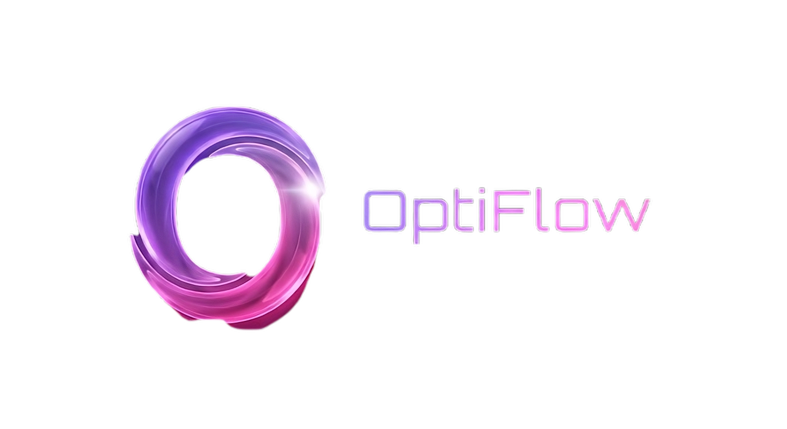
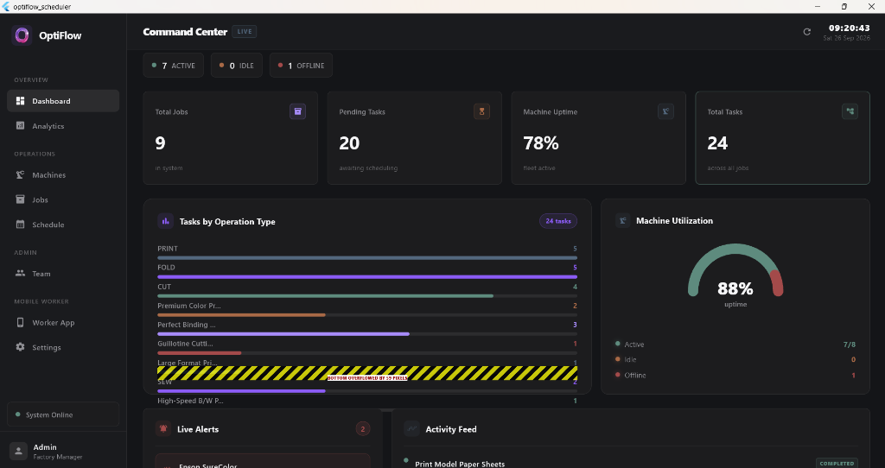
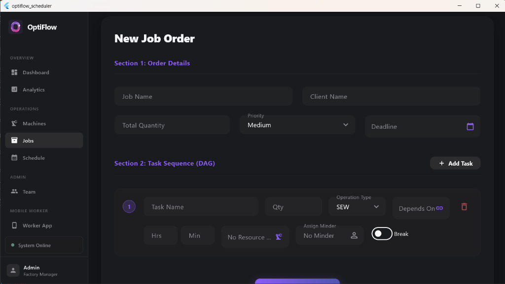
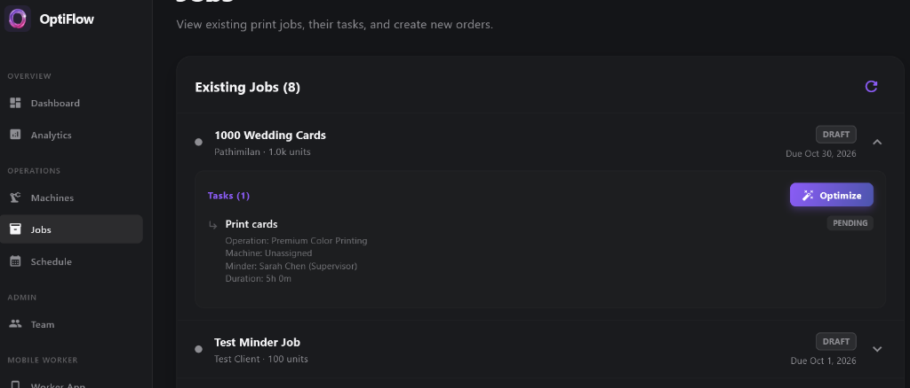
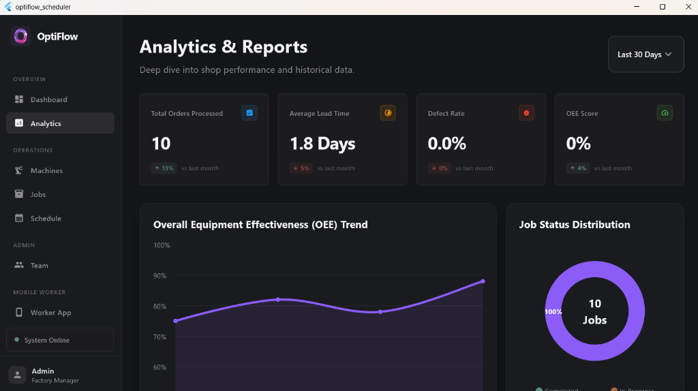
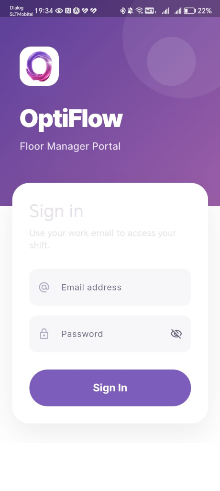
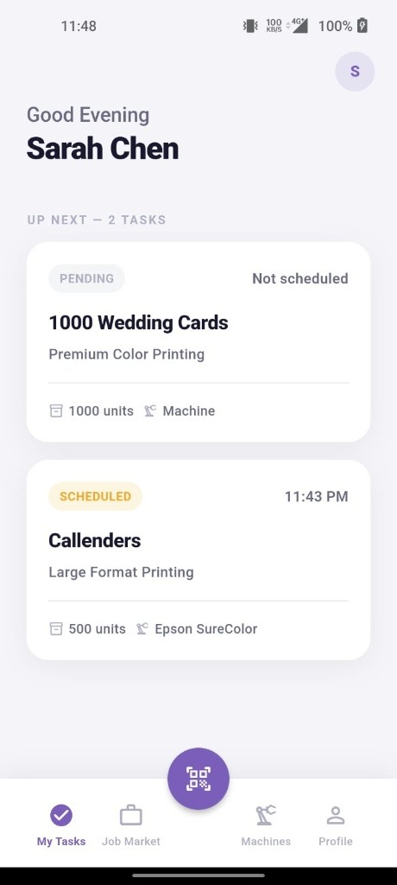
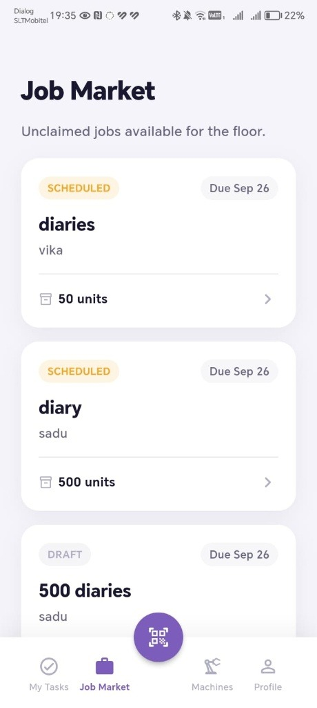

<p align="center">
  
</p>

# OptiFlow - Intelligent Production Scheduling System

**Smarter Scheduling. Smoother Production.**

OptiFlow is an intelligent production scheduling and workflow-management system developed for industrial print shops and light-manufacturing facilities. It empowers plant managers to create complex multi-task jobs, configure Directed Acyclic Graph (DAG) task dependencies, allocate specialized machinery and human minders, and automatically generate optimal, conflict-free schedules using constraint programming. With a dual-interface architecture—a feature-rich Manager Desktop Dashboard and a streamlined Mobile Worker Portal—OptiFlow bridges high-level optimization with real-time floor execution.

<p align="center">
  
  <br>
  <em>Figure 1: OptiFlow Command Center LIVE — Real-time shop-floor operational status, equipment utilization metrics, and activity tracking.</em>
</p>

## Team

- E/22/320, M. S. Rashad, [e22320@eng.pdn.ac.lk](mailto:e22320@eng.pdn.ac.lk)
- E/22/337, K. Sadurshika, [e22337@eng.pdn.ac.lk](mailto:e22337@eng.pdn.ac.lk)
- E/22/385, S. Sulakshan, [e22385@eng.pdn.ac.lk](mailto:e22385@eng.pdn.ac.lk)
- E/22/409, S. Vikashan, [e22409@eng.pdn.ac.lk](mailto:e22409@eng.pdn.ac.lk)

## Supervisor

- E/21/148, S. Ganathipan, [e21148@eng.pdn.ac.lk](mailto:e21148@eng.pdn.ac.lk)

---

## Table of Contents

1. [Introduction](#1-introduction)
2. [Solution Architecture](#2-solution-architecture)
3. [Software Design & UI Showcase](#3-software-design--ui-showcase)
4. [Scheduling and Optimization](#4-scheduling-and-optimization)
5. [System Usage and Setup](#5-system-usage-and-setup)
6. [Testing](#6-testing)
7. [Limitations and Future Improvements](#7-limitations-and-future-improvements)
8. [Conclusion](#8-conclusion)
9. [Links](#9-links)

---

## 1. Introduction

### 1.1 Project Overview

Commercial printing and manufacturing environments handle dozens of concurrent, multi-stage production orders. A single product (such as a 5,000-unit sewn hardbound diary or school model exam papers) involves a strict sequence of dependent operations:

```text
Order Intake ➔ High-Speed Printing ➔ [Ink Drying Wait] ➔ Folding ➔ Sewing / Binding ➔ Guillotine Cutting ➔ Quality Check
```

Each operation requires specific machine capabilities, certified machine minders, and precise processing windows. Manually scheduling these workflows across shared equipment inevitably causes bottlenecks, idle equipment, worker confusion, and missed delivery deadlines.

OptiFlow replaces error-prone whiteboards and spreadsheets with an automated, constraint-driven platform. It models production constraints mathematically and uses Google OR-Tools CP-SAT to calculate provably optimal or high-quality schedules in seconds.

### 1.2 Real-World Problem

Manual production scheduling in print shops suffers from critical operational friction:

- **Resource Conflicts:** Two urgent jobs allocated to the same press or cutter simultaneously.
- **Dependency Violations:** Tasks starting before predecessors finish or before mandatory ink-drying intervals elapse.
- **Machine Downtime & Overheating:** Neglecting post-task cooling, maintenance, or washup breaks.
- **Minder Misallocation:** Jobs scheduled on machines without an available certified operator.
- **Disconnected Shop Floor:** Floor workers receiving verbal or outdated schedules, leading to delayed job handoffs.
- **Lack of Visibility:** Managers unable to track overall equipment effectiveness (OEE), live lead times, or fleet status.

### 1.3 Proposed Solution

OptiFlow solves these challenges by combining:

1. **Manager Command Center (Desktop):** Complete oversight over active jobs, real-time fleet health, DAG workflow creation, machine and minder assignments, and historical analytics.
2. **1-Click Mathematical Optimization Engine (Backend):** CP-SAT constraint programming that slots tasks without overlaps, respects predecessor wait times, accounts for machine maintenance breaks, and prioritizes urgent orders.
3. **Floor Worker Mobile Portal (Mobile):** A tailored mobile app for floor operators to view personalized shift queues ("My Tasks"), inspect machine assignments, claim unallocated work via the "Job Market", and update task execution statuses in real time.

### 1.4 Main Features

- **Multi-Task Job Creation with DAG Precedence:** Define complex workflows where any task can depend on one or more previous operations with mandatory waiting times.
- **Dual-Resource Allocation (Machine + Minder):** Assign both physical machinery and certified human workers to each stage of production.
- **Duration Parsing (Hours & Minutes):** Intuitive time entry converted dynamically into exact processing minutes.
- **Machine-Break & Cooldown Configuration:** Per-task cooldown or washup breaks that hold the resource before the next job can begin.
- **Flexible Resource Constraints:** Choose strict machine restrictions or let the optimizer pick the best capable active machine.
- **Interactive Command Center Dashboard:** Real-time metrics for total orders, pending tasks, machine uptime, and operation breakdowns.
- **Production Analytics & OEE Tracking:** Historical lead-time tracking, defect rate monitoring, and OEE trend visualization.
- **Mobile Worker Shift Stream:** Role-filtered task lists ("Up Next" and "Active Now") linked to the authenticated worker.
- **Floor Job Market:** Self-service claiming of unassigned floor jobs directly from mobile devices.

---

## 2. Solution Architecture

OptiFlow is designed as a modular, decoupled four-tier architecture:

```text
+-------------------------------------------------------------+
|                     PRESENTATION TIER                       |
|  Flutter Desktop (Manager Hub)  |  Flutter Mobile (Floor)   |
|  - Command Center Dashboard     |  - Worker Sign-In Portal  |
|  - DAG Order & Minder Builder   |  - Personal Task Stream   |
|  - Schedule & Analytics View    |  - Floor Job Market       |
+------------------------------+------------------------------+
                               |
                               | REST API / JSON (HTTP)
                               v
+-------------------------------------------------------------+
|                      APPLICATION TIER                       |
|                    FastAPI Backend (Python)                 |
|  - Pydantic Schema Validation & REST Endpoints              |
|  - Job & Task Lifecycle Management                          |
|  - Dual Resource & Capability Mapping                       |
|  - Optimizer Dispatch & Response Formatting                 |
+------------------------------+------------------------------+
                               |
         +---------------------+---------------------+
         |                                           |
         v                                           v
+-------------------------------+   +-------------------------------+
|         DATA TIER             |   |       OPTIMIZATION TIER       |
|      Supabase PostgreSQL      |   |    Google OR-Tools CP-SAT     |
| - Relational Schema & RLS     |   | - Constraint Programming      |
| - Auth & Role-Based Minders   |   | - No-Overlap 2D Intervals     |
| - Jobs, Tasks, DAG Relations  |   | - Precedence & Wait Windows   |
| - Resource Statuses & Logs    |   | - Makespan & Priority Tuning  |
+-------------------------------+   +-------------------------------+
```

### 2.1 Presentation Tier (Flutter & Dart)

The frontend is built with Flutter for unified cross-platform execution on Windows Desktop (managers) and Android/iOS (floor minders). It features custom glassmorphic dark-mode styling, real-time status badges, responsive layout builders, and direct REST/Supabase client connectivity.

### 2.2 Application Tier (FastAPI & Python)

The backend provides high-performance asynchronous REST endpoints. It validates incoming order structures, enforces business rules, resolves candidate capabilities for machines and workers, builds constraint definitions for the optimizer, and persists results atomically.

### 2.3 Data Tier (Supabase PostgreSQL)

Supabase provides enterprise-grade PostgreSQL with real-time replication. Relational tables track:
- `jobs`: Master orders with priorities, deadlines, and clients.
- `tasks`: Individual production stages with durations, operation types, assigned machine IDs, and assigned minder IDs.
- `task_dependencies`: Predecessor-successor DAG edges with mandatory wait minutes.
- `resources`: Machine fleet and human workers with live statuses (`ACTIVE`, `MAINTENANCE`, `OFFLINE`).
- `resource_capabilities`: Many-to-many matrix linking machines to qualified operation types.
- `worker_machine_assignments`: Junction linking human minders to authorized machines.

### 2.4 Optimization Tier (Google OR-Tools CP-SAT)

The optimization engine formulates production scheduling as a Constraint Satisfaction and Optimization Problem (COP). It evaluates all valid machine candidates per operation, builds non-overlapping interval variables, enforces precedence inequalities, and minimizes the global makespan weighted by job priority.

---

## 3. Software Design & UI Showcase

### 3.1 Design Principles

- **Separation of Concerns:** Clear demarcation between data storage, optimization logic, API routing, and user interface.
- **Fail-Safe Scheduling:** Validation ensures tasks cannot be scheduled without valid capable resources.
- **Live Floor Synchronization:** Mobile apps synchronize with desktop scheduling so operators see updates instantly.
- **Visual Clarity:** Dark-mode dashboard interfaces prevent visual fatigue in high-contrast industrial environments.

### 3.2 Technology Stack

| Component | Technology | Role |
|---|---|---|
| **Manager Frontend** | Flutter (Desktop) | Command center, DAG order creation, analytics |
| **Worker Frontend** | Flutter (Mobile) | Personal shift task stream, floor job market |
| **Backend Framework** | FastAPI (Python 3.11+) | Asynchronous API, validation, business logic |
| **Optimization Solver** | Google OR-Tools CP-SAT | Finite-domain constraint scheduling engine |
| **Database & Auth** | Supabase (PostgreSQL) | Relational persistence, Auth tokens, RLS |
| **State Management** | Provider / Stateful Hooks | Reactive UI updates across views |
| **HTTP Communication** | HTTP / JSON REST | Secure payload exchange |

---

### 3.3 User Interface Walkthrough

#### 3.3.1 Manager Command Center & Live Dashboard

The Command Center provides a high-level operational pulse of the entire manufacturing floor. Managers can monitor machine uptime gauges, active vs. offline equipment counts, total pending operations, task counts grouped by operation type, and a live activity audit feed.

<p align="center">
  
  <br>
  <em>Figure 2: Manager Command Center with fleet health badges (7 Active, 1 Offline), uptime gauge, and operation distributions.</em>
</p>

#### 3.3.2 Advanced Job Order Builder with DAG Sequencing

Creating a job order is divided into two intuitive sections:
1. **Order Details:** Job title, client name, total print units, priority level (`HIGH`, `MEDIUM`, `LOW`), and delivery deadline date picker.
2. **Task Sequence (DAG):** Managers can add multiple tasks, define predecessor dependencies (`Depends On`), enter duration in separate hours and minutes fields, restrict to specific machines or allow any capable machine, assign a certified human minder, and enable post-task maintenance cooldowns.

<p align="center">
  
  <br>
  <em>Figure 3: Multi-task Job Order Creator supporting DAG dependencies, duration parsing, minder assignment, and cooling breaks.</em>
</p>

#### 3.3.3 Job Management & 1-Click CP-SAT Optimization

The **Jobs** screen lists all active and draft orders. Expanding an order reveals its sub-tasks, current execution state (`DRAFT`, `PENDING`, `SCHEDULED`, `IN_PROGRESS`, `COMPLETED`), allocated machine, and assigned minder. Clicking the purple **Optimize** button immediately invokes the backend CP-SAT solver, converting unscheduled tasks into timed machine allocations.

<p align="center">
  
  <br>
  <em>Figure 4: Job Management screen showing task statuses, assigned minder Sarah Chen, and the 1-click Optimize trigger.</em>
</p>

#### 3.3.4 Production Analytics & OEE Reporting

The **Analytics & Reports** module provides managers with deep insights into factory throughput. It calculates Overall Equipment Effectiveness (OEE), tracks historical lead time reductions, displays defect rates, and renders job status distribution charts over customized reporting windows (e.g., Last 30 Days).

<p align="center">
  
  <br>
  <em>Figure 5: Production Analytics tracking Overall Equipment Effectiveness (OEE) trends, average lead times, and order distribution.</em>
</p>

#### 3.3.5 Floor Worker & Minder Mobile Portal

Floor operators interact through a tailored mobile application that connects directly to their shift responsibilities:
- **Floor Sign-In:** Dedicated authentication portal for machine operators and shift minders.
- **Personalized "My Tasks" Stream:** Automatically filters tasks assigned specifically to the logged-in worker (e.g., Sarah Chen), clearly displaying the target machine (e.g., *Epson SureColor*), scheduled execution window, and unit counts.
- **Floor Job Market:** Displays unallocated floor orders that certified workers can voluntarily claim.

<p align="center">
  &nbsp;
  &nbsp;
  
  <br>
  <em>Figure 6: Mobile Floor Portal — (Left) Worker Login, (Center) Personalized Task Queue for Sarah Chen, (Right) Floor Job Market.</em>
</p>

---

## 4. Scheduling and Optimization

### 4.1 Production Routing Workflow

OptiFlow is designed around standard manufacturing workflows such as sewn bookbinding and model paper production:

```text
[ Job Order Intake ]
        |
        v
[ 1. Printing ] ----------> Heidelberg Speedmaster / HP Indigo
        |
        v (Mandatory Ink Drying Wait: 15-30 mins)
[ 2. Folding ] -----------> MBO Folding Machine
        |
        v
[ 3. Sewing / Binding ] --> Horizon BQ-470 / Aster Sewing
        |
        v (Glue Curing Break: 10 mins)
[ 4. Cutting ] -----------> Polar 115 Guillotine
        |
        v
[ Completed & QC ]
```

### 4.2 Mathematical Formulation (CP-SAT)

The optimizer models the production floor as a discrete set of Jobs, Tasks, and Resources (Machines & Minders). Each operational constraint is formulated in Google OR-Tools CP-SAT as follows:

#### 1. Precedence Constraint with Mandatory Wait / Drying Times
A successor task cannot start until its predecessor has finished and any required ink-drying or glue-curing interval has elapsed:
```text
Start(Task B)  ≥  End(Task A) + Mandatory_Wait_Duration
```
* **Real-World Impact:** Prevents wet ink from smearing during high-speed folding or binding.

#### 2. Machine Disjunctive Constraint (No Overlapping Work)
A machine can process only one task at any given time. If two tasks are assigned to the same machine, their time intervals cannot overlap:
```text
Interval(Task i) ∩ Interval(Task j) = ∅    (for all i ≠ j on Machine k)
```
* **Solver Implementation:** Enforced natively via CP-SAT's `model.AddNoOverlap(machine_intervals)`.

#### 3. Task-Level Machine Maintenance / Cooldown Break
Heavy print runs or thermal binding cycles require post-task machine maintenance or cooldown before the machine can accept new work:
```text
Machine_Release_Time = Task_End_Time + Break_Duration
```
* **Real-World Impact:** Prevents machine overheating, provides washup periods, and extends equipment life.

#### 4. Dual-Resource Coupling (Machine + Certified Minder)
Operations requiring both a machine and a human operator ensure both resources are booked simultaneously for the exact same interval:
```text
Start(Machine) = Start(Minder)   AND   End(Machine) = End(Minder)
```
* **Real-World Impact:** Eliminates idle machines waiting for operators and prevents workers from being double-booked.

#### 5. Multi-Objective Function
The optimizer minimizes total makespan while applying heavy penalties for late completion against customer deadlines:
```text
Minimize: [ α × Total_Makespan ] + Σ [ Priority_Weight(j) × Max(0, Completion_Time(j) - Deadline(j)) ]
```
* **Priority Weights:** High Priority ($w = 3$), Medium Priority ($w = 2$), Low Priority ($w = 1$).


---

## 5. System Usage and Setup

### 5.1 Prerequisites

- **Python 3.11+**
- **Flutter SDK (3.24+ / 3.47+) & Dart**
- **Android Studio / VS Code** with Flutter & Dart extensions
- **Supabase Account** with PostgreSQL database access
- **Git**

### 5.2 Clone Repository

```bash
git clone https://github.com/cepdnaclk/e22-co2060-OptiFlow.git
cd e22-co2060-OptiFlow
```

### 5.3 Backend Setup

1. Navigate to the backend directory:
   ```bash
   cd optiflow_back
   ```

2. Create and activate a Python virtual environment:
   ```powershell
   python -m venv venv
   .\venv\Scripts\Activate.ps1
   ```

3. Install dependencies:
   ```bash
   pip install -r requirements.txt
   ```

4. Configure environment variables (`optiflow_back/.env`):
   ```ini
   SUPABASE_URL=https://your-project.supabase.co
   SUPABASE_KEY=your-supabase-anon-or-service-key
   ```

5. Seed demo datasets (Optional but recommended for demonstration):
   ```bash
   # Step 1: Wipe and seed machines, human minders, and capabilities
   python seed_pitch_data.py

   # Step 2: Register Supabase Auth credentials for minders (Sarah, Marcus, Elena)
   python create_minders.py

   # Step 3: Insert sample un-optimized job orders for live demo
   python seed_demo_final.py
   ```

6. Start FastAPI server:
   ```bash
   uvicorn main:app --reload --port 8000
   ```
   * Interactive Swagger Docs: `http://127.0.0.1:8000/docs`

### 5.4 Frontend Setup

1. Open a new terminal from repository root:
   ```bash
   cd optiflow_front
   flutter pub get
   ```

2. Start the desktop or mobile application:
   ```bash
   # Run Desktop Manager App (Windows)
   flutter run -d windows

   # Run Mobile Worker App (Connected Android Device)
   flutter run -d <device_id>
   ```

3. **1-Click Startup:**
   On Windows, you can launch both backend and frontends simultaneously by double-clicking:
   ```powershell
   .\run.bat
   ```

---

## 6. Testing

### 6.1 Backend Test Suite

The backend includes comprehensive test coverage for optimization constraints, input validation, and API routing:

```powershell
cd optiflow_back
$env:PYTHONPATH="."
pytest -v tests/
```

Key verification areas include:
- `test_optimizer.py`: Precedence constraints, break interval non-overlap, and makespan minimization.
- `test_api_endpoints.py`: CRUD endpoints, `/api/create_job`, and `/api/resources`.
- `test_worker_allocation.py`: Worker-machine assignment resolution and role filtering.

### 6.2 Frontend & Static Analysis

```powershell
cd optiflow_front
flutter test
flutter analyze
```

---

## 7. Limitations and Future Improvements

### 7.1 Current Limitations

- **Single-Facility Scope:** The current solver models a single manufacturing plant rather than multi-site routing.
- **Manual Reruns for Disruptions:** Real-time unexpected machine breakdowns require triggering a re-optimization run.
- **Network Dependency:** Offline mobile clients require connectivity to synchronize completed task statuses with Supabase.

### 7.2 Future Improvements

- **Dynamic Reactive Rescheduling:** Webhooks that automatically shift subsequent tasks when an upstream machine reports an error.
- **Predictive Duration Learning:** Machine learning models that refine task duration estimates based on operator historical performance.
- **Direct IoT Machine Telemetry:** Automatic task progress updates via PLC / IoT sensor integration on printing presses.
- **Push Notifications:** Instant mobile alerts for minders when new priority tasks are scheduled to their machines.

---

## 8. Conclusion

OptiFlow demonstrates how modern constraint programming and cross-platform UI engineering can solve complex industrial production challenges. By combining Google OR-Tools CP-SAT with a responsive Flutter architecture and Supabase real-time storage, the system eliminates scheduling conflicts, respects physical operational constraints, optimizes equipment utilization, and seamlessly connects plant managers with floor workers.

---

## 9. Links

- [Project Repository](https://github.com/cepdnaclk/e22-co2060-OptiFlow)
- [Project Documentation Page](https://cepdnaclk.github.io/e22-co2060-OptiFlow/)
- [Department of Computer Engineering, University of Peradeniya](https://www.ce.pdn.ac.lk/)
- [Faculty of Engineering](https://eng.pdn.ac.lk/)

---

<p align="center">
  Department of Computer Engineering<br>
  Faculty of Engineering<br>
  University of Peradeniya
</p>
